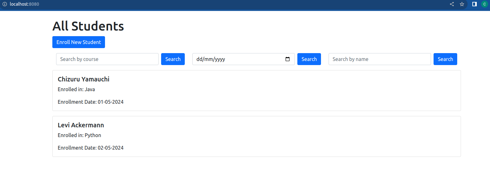
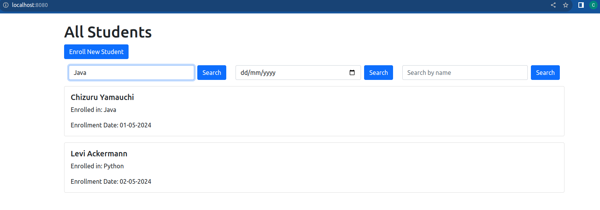
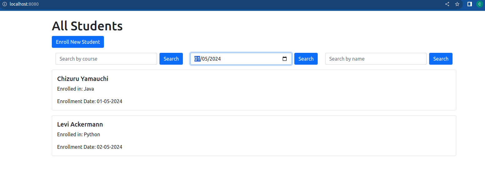
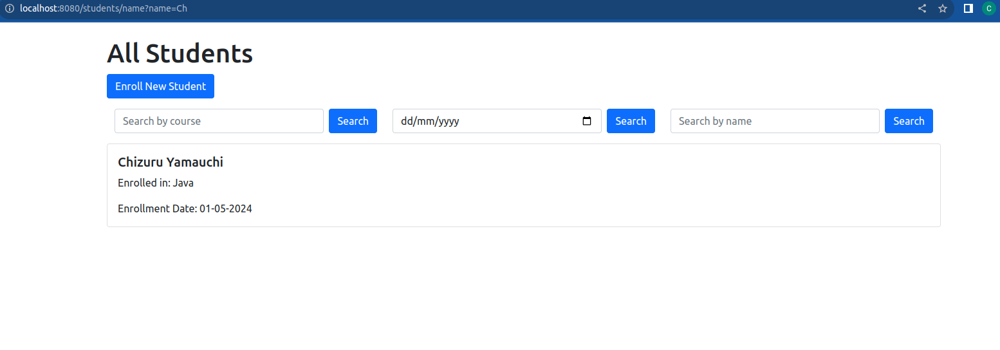

### Student Enrollment System

Assignment created and guided with README file by Safwan kher(https://github.com/safwan-kher).

---
README and instruction by Safwan kher.

### Assignment: Building a Student Enrollment System Using Spring Boot, Thymeleaf, PostgreSQL, and JPA Hibernate

#### Objective:
Develop a simple web-based student enrollment system that allows users to add, view, and manage student entries. This system will utilize Spring Boot for the backend, Thymeleaf for the frontend, PostgreSQL as the database, and JPA Hibernate for ORM.

#### Requirements:
1. **Setup and Configuration:**
    - Use Maven to manage project dependencies.
    - Configure PostgreSQL as the database for storing student data.
    - Set up Spring Boot with necessary dependencies for Web, Thymeleaf, JPA, and PostgreSQL.

2. **Database Model:**
    - Create a `Student` entity with fields such as `id`, `name`, `enrollmentDate`, and `course`.

3. **Repository Layer:**
    - Implement a repository interface for the `Student` entity using Spring Data JPA.

4. **Service Layer:**
    - Develop a service class to handle the logic for adding, retrieving, and listing all students.

5. **Controller Layer:**
    - Create a controller to manage HTTP requests such as GET and POST for adding and viewing students.

6. **View Layer:**
    - Utilize Thymeleaf to create HTML templates for the student submission form, the home page listing all students, and a submission result page.

#### Tasks:

1. **Project Setup:**
    - Initialize a Spring Boot project with required dependencies.
    - Configure `application.properties` for database connection and Hibernate settings.

2. **Entity Creation:**
    - Define a `Student` entity with annotations to map it to a PostgreSQL table.

3. **Repository Setup:**
    - Create an interface extending `JpaRepository` for the `Student` entity.

4. **Service Implementation:**
    - Implement methods in the service class to save a student to the database and retrieve student entries.

5. **Controller Implementation:**
    - Develop endpoints to display the submission form, accept form submissions, and display all students.

6. **Thymeleaf Templates:**
    - Design HTML pages using Thymeleaf for displaying the form, listing students, and showing submission results.

7. **Testing:**
    - Test the application to ensure that students can be added and viewed correctly.

#### Deliverables:
- Source code for the entire application including entity, repository, service, and controller classes.
- Thymeleaf templates for the user interface.
- A detailed README file documenting how to set up and run the application.

#### Evaluation Criteria:
- Functionality: The application should meet all the functional requirements specified.
- Code Quality: The code should be clean, well-organized, and properly commented.
- Design and Usability: The Thymeleaf templates should be user-friendly and aesthetically pleasing.
- Error Handling: The application should gracefully handle and report errors.

This assignment will help you understand how to integrate various components of a Spring Boot application and provide practical experience with web application development using MVC architecture.

----

### Result

